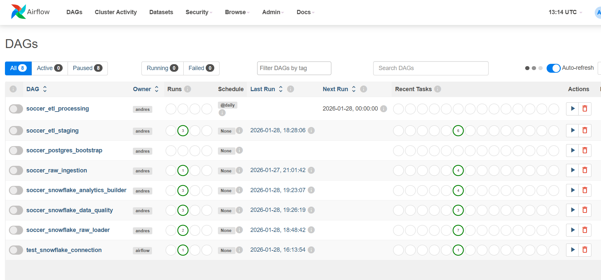
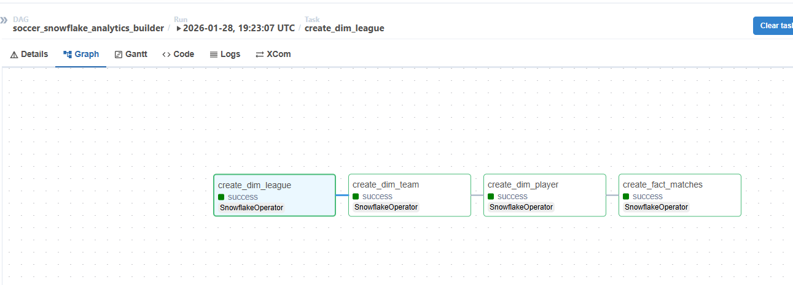
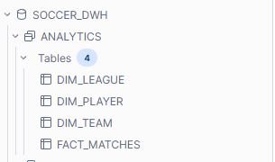
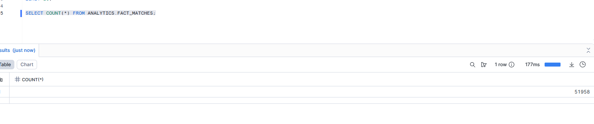

## Soccer Data Engineering Platform

An end-to-end production-style data engineering platform that ingests raw soccer datasets, performs scalable transformations, and builds analytics-ready star schema tables in Snowflake using Apache Airflow orchestration.

This project simulates a real-world ELT pipeline with containerized infrastructure, chunk-based batch processing, warehouse modeling, and automated data quality validation.

## Project Objectives

- Build a scalable batch ingestion pipeline for large datasets
- Implement ELT architecture using PostgreSQL and Snowflake
- Orchestrate multi-stage workflows using Apache Airflow
- Design analytics-ready star schema models
- Apply data quality validation and pipeline health monitoring
- Demonstrate production engineering best practices

## Technology Stack:

| Layer            | Technology                  |
| ---------------- | --------------------------- |
| Ingestion        | Python, Pandas              |
| Orchestration    | Apache Airflow 2.8 (Docker) |
| Database         | PostgreSQL 15               |
| Warehouse        | Snowflake                   |
| Transformations  | SQL (Postgres + Snowflake)  |
| Containerization | Docker Compose              |
| Version Control  | GitHub                      |

## High-Level Architecture

```
Kaggle Soccer Dataset (SQLite)
            │
            ▼
CSV Export Layer
            │
            ▼
Airflow DAG — Raw Ingestion
(Chunked Load + Health Checks)
            │
            ▼
PostgreSQL RAW Schema
            │
            ▼
Airflow DAG — Staging ETL
(Cleaning + Normalization)
            │
            ▼
PostgreSQL STAGING Schema
            │
            ▼
Airflow DAG — Snowflake RAW Loader
            │
            ▼
Snowflake RAW Schema
            │
            ▼
Airflow DAG — Analytics Builder
            │
            ▼
Snowflake ANALYTICS (Star Schema)
            │
            ▼
Airflow DAG — Data Quality Validation
```

## Pipeline Components

# Phase 0 — PostgreSQL Bootstrap (Environment Initialization)

DAG: soccer_postgres_bootstrap

This phase initializes the PostgreSQL analytics environment and is used primarily for development setup and testing purposes.  
It prepares database schemas and tables before running production ELT pipelines and allows the environment to be reset quickly during development.

Task Flow

```
health_check
      ↓
create_schema
      ↓
create_tables
      ↓
load_analytics_tables
```

Responsibilities

- Validates container health and volume mounts before initialization
- Creates PostgreSQL analytics schemas
- Creates required analytics tables
- Loads initial processed datasets for local testing and development validation
- Enables repeatable environment setup during development cycles

Purpose In Architecture

- This DAG is intentionally not part of the production data pipeline.

It exists to:

- Bootstrap database environments
- Support local testing and development workflows
- Validate schema definitions before migrating analytics workloads to Snowflake
- Separate infrastructure initialization from production ELT logic

# Phase 1 — Raw Ingestion (PostgreSQL RAW)

DAG: soccer_raw_ingestion

Task Flow

```
health_check
↓
create_raw_schema
↓
create_raw_tables
↓
load_raw_tables_task
```

Responsibilities

- Validates container health and volume mounts
- Creates RAW schema and tables
- Loads Kaggle CSV datasets into PostgreSQL
- Uses chunk-based ingestion for large files (269MB+ match dataset)
- Normalizes column naming and schema formatting

# Phase 2 — File Validation (Pre-ETL Check)

DAG: soccer_etl_processing

Task Flow

```
health_check
↓
check_files
```

Responsibilities

- Verifies dataset availability before transformation stage
- Prevents downstream pipeline failures due to missing inputs

# Phase 3 — Staging Transformations (PostgreSQL STAGING)

DAG: soccer_etl_staging

Task Flow

```
create_schema
↓
create_tables
↓
transform_leagues
↓
transform_teams
↓
transform_players
↓
transform_matches
```

Responsibilities

- Creates STAGING schema and tables
- Cleans null values and malformed records
- Normalizes team and league entities
- Deduplicates players using latest attribute snapshots
- Applies domain transformations such as goal differentials and match flags
- Produces analytics-ready staging datasets

# Phase 4 — Connectivity Testing

DAG: test_snowflake_connection

Responsibilities

- Verifies Snowflake connectivity from Airflow
- Ensures credential and network configuration correctness

# Phase 5 — Snowflake RAW Load

DAG: soccer_snowflake_raw_loader

Responsibilities

- Transfers PostgreSQL RAW tables into Snowflake RAW schema
- Uses Pandas chunk-based loading for memory-safe processing
- Optimized chunk size for Docker + Snowflake stability
- Uppercases column names for Snowflake compatibility

Example Tables Loaded

- country
- league
- team
- player
- player_attributes
- team_attributes
- match

Implementation Highlights

- SQLAlchemy engines for both Postgres and Snowflake
- Incremental chunk streaming using read_sql(chunksize=20000)
- Multi-row batch inserts using Snowflake connector
- Logging of chunk progress and row counts

# Phase 6 — Snowflake Analytics Build

DAG: soccer_snowflake_analytics_builder

Task Flow

```
create_dim_league
↓
create_dim_team
↓
create_dim_player
↓
create_fact_matches
```

Responsibilities

- Builds analytics star schema
- Full-refresh dimensional modeling
- Applies business logic transformations
- Produces BI-ready fact and dimension tables

# Phase 7 — Data Quality Validation

DAG: soccer_snowflake_data_quality

Task Flow

```
check_fact_not_empty
↓
check_no_negative_goals
↓
check_dim_team_not_null
```

Responsibilities

- Validates fact table population
- Prevents invalid metrics (negative goals)
- Ensures key dimension attributes are not null
- Protects downstream analytics reliability

## 📊 Analytics Star Schema Design

```
                DIM_LEAGUE
               ┌───────────┐
               │ league_id │
               │ name      │
               └─────┬─────┘
                     │

DIM_TEAM        FACT_MATCHES        DIM_PLAYER
┌─────────┐    ┌─────────────┐    ┌───────────┐
│ team_id │◄───│ home_team   │───►│ player_id │
│ name    │    │ away_team   │    │ name      │
└─────────┘    │ league_id   │    └───────────┘
               │ goals       │
               │ season      │
               │ goal_diff   │
               │ win_flags   │
               └─────────────┘
```

## Engineering Challenges Solved

- Chunked ingestion optimized for large CSV files
- Snowflake column formatting compatibility issues resolved
- Player name parsing errors corrected ("Messi, 10")
- Schema mismatches across datasets normalized
- DAG zombie task prevention
- Memory pressure reduced during Snowflake loads
- Large dataset artifacts removed from Git history

## Results

- Fully automated end-to-end pipeline
- Production-style ELT architecture
- Dockerized reproducible environment
- Analytics-ready Snowflake star schema
- Integrated data quality validation
- Scalable ingestion for large datasets

## Pipeline Screenshots





### Snowflake Warehouse




